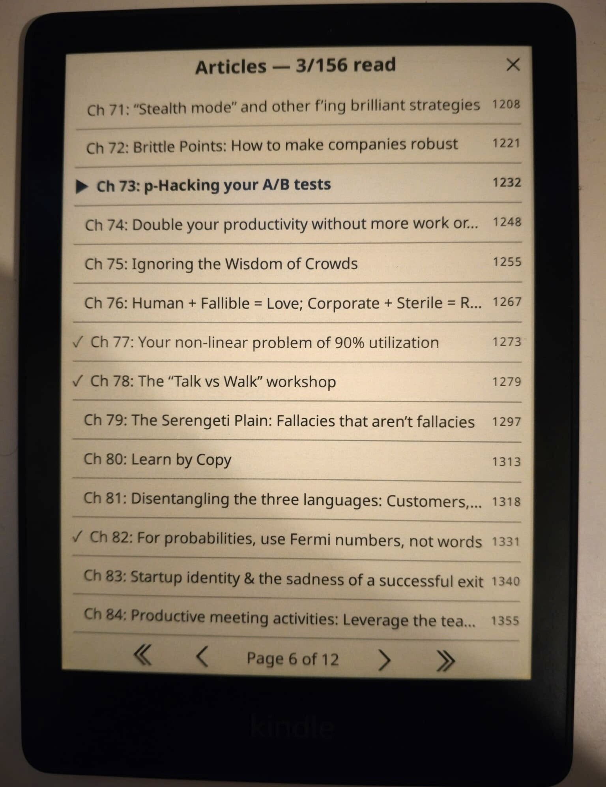
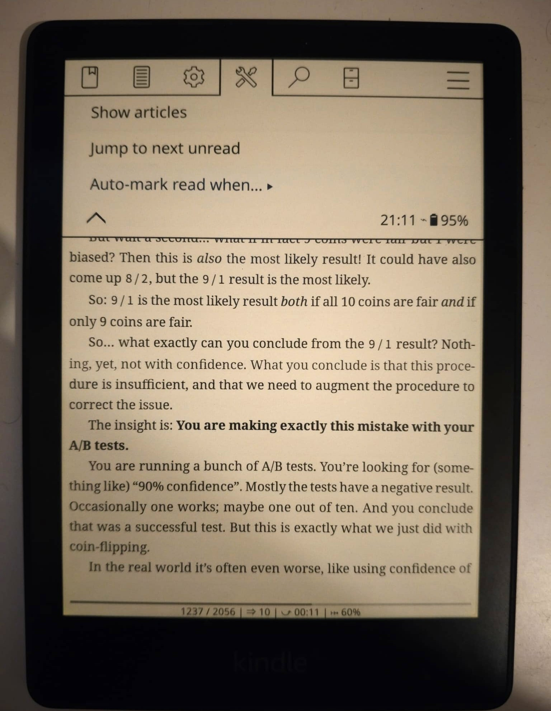
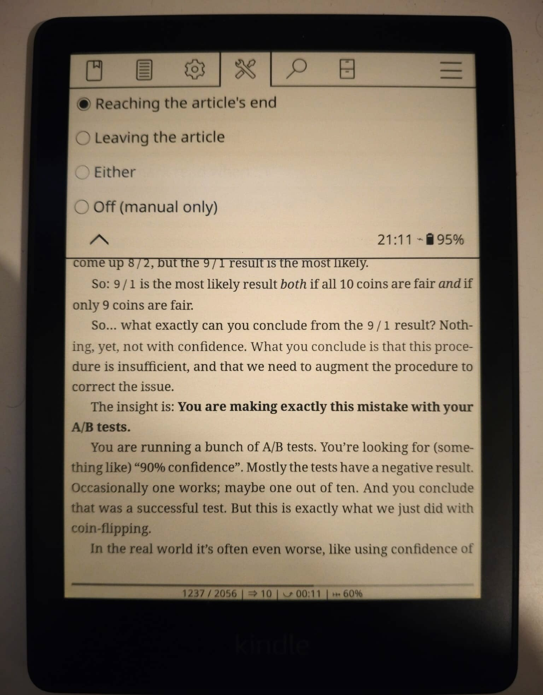
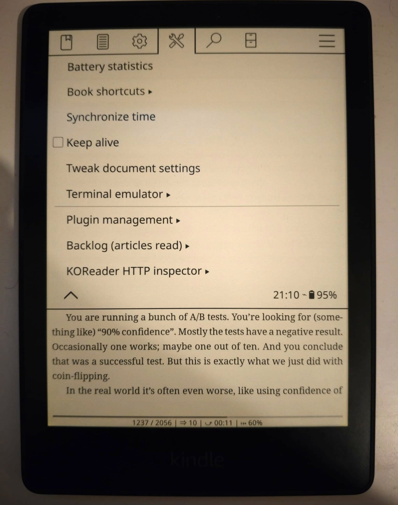

# Backlog

**Per-article read tracking for anthology EPUBs in KOReader.**

## The problem

Some EPUBs aren't linear books, they're **collections of standalone, cross-linked essays or articles** (anthologies, blog archives, essay collections) that you read in **any order**, hopping between pieces via links.

KOReader treats the whole file as one book with a single progress bar, which tells you nothing useful here. And when you tap a link to a *referenced* article, there's no way to answer the one question that actually matters:

> **"Wait — have I already read this one?"**

**Backlog** answers it. It treats each chapter (each top-level table-of-contents entry) as a separate **article**, remembers which ones you've read, shows them all in one list, and marks them read automatically as you finish — so you always know what's left, no matter how non-linearly you read.

## Screenshots

| | |
|:--:|:--:|
| <br>*Articles list — ✓ read, ▶ current, running count* | <br>*The Backlog menu* |
| <br>*Auto-mark modes* | <br>*Found under Tools → More tools* |

## Features

- **Articles list** — every article with its status at a glance: **✓ read**, **▶ currently reading**, or unread, plus a **"N / total read"** counter.
- **Tap to jump** to any article; **long-press to toggle** its read/unread state.
- **Auto-mark on finish** — an article is marked read when you reach its end (configurable — see [Settings](#settings)).
- **Jump to next unread** — one action that takes you straight to the next article you haven't read (bindable to a gesture).
- **Per-book persistence** — read state is saved with the book and keyed by each article's *location* in the document, so it **survives font changes (re-pagination) and restarts**.
- **Opt-in per book** — Backlog stays dormant until you open its article list for a book. Books you never use it on are left completely untouched (nothing is even written to their metadata).

## Requirements

- **KOReader** (a recent version) on any supported device: Kindle, Kobo, PocketBook, Android, or the Linux/macOS desktop build.
- A book with a **table of contents** (EPUB and other reflowable formats). The more its chapters are standalone articles, the more useful Backlog is.

## Installation

### Manual

1. Download the latest release (or clone this repo) to get the `backlog.koplugin` folder.
2. Copy it into KOReader's `plugins` directory:
   | Device | Path |
   | --- | --- |
   | Kindle | `/mnt/us/koreader/plugins/` |
   | Kobo | `.adds/koreader/plugins/` |
   | PocketBook | `applications/koreader/plugins/` |
   | Android | `koreader/plugins/` (in KOReader's data directory) |
   | Linux / desktop | `~/.config/koreader/plugins/` |
3. Restart KOReader.

### KOReader App Store

If you have the [App Store plugin](https://github.com/omer-faruq/appstore.koplugin), install Backlog right on the device: **Tools → App Store**, search **Backlog**, install. No computer needed.

## Usage

Open a book that's a collection of articles, then:

1. Tap the top of the screen → the **Tools** (wrench) menu → **More tools → Backlog (articles read) → Show articles.**
2. In the list:
   - **Tap** an article to jump to it.
   - **Long-press** an article to mark it read / unread.
3. As you read, finishing an article marks it read automatically (configurable below).

**Tip:** bind the actions **"Backlog: articles"** and **"Backlog: next unread"** to gestures (Settings → Taps and gestures → Gesture manager) for one-tap access without digging through the menu.

## Settings

Under **Backlog → Auto-mark read when…**:

| Mode | An article is auto-marked read when… |
| --- | --- |
| **End of article** *(default)* | you reach its last page |
| **On leaving** | you move on to another article, after reading most of it |
| **Either** | whichever happens first |
| **Off** | never — you mark articles read manually only |

Auto-marking is never triggered by *jumping* to an article (via a link or the list) — only by actually reading through it.

## How it works

Backlog reads the book's **table of contents** and treats each **top-level entry** as an article. It records read state in the book's KOReader sidecar (the per-book metadata KOReader already keeps), keyed by each article's **stable location in the document** (its xpointer) rather than a page number — which is why marks survive re-pagination. The EPUB itself is never modified.

## Development

The decision logic lives in `lib/model.lua` with **no KOReader dependencies**, so it's unit-tested in isolation:

```sh
busted spec/unit/model_spec.lua   # with the busted framework
luajit spec/run.lua               # or zero-install, with just LuaJIT
```

Linting uses a config that mirrors KOReader's own:

```sh
luacheck .
```

The KOReader-coupled glue (`main.lua`, `ui/articles_view.lua`) is verified in the KOReader emulator.

## License

Released under the [MIT License](LICENSE).

## Acknowledgements

Built on [KOReader](https://github.com/koreader/koreader)'s plugin API.
